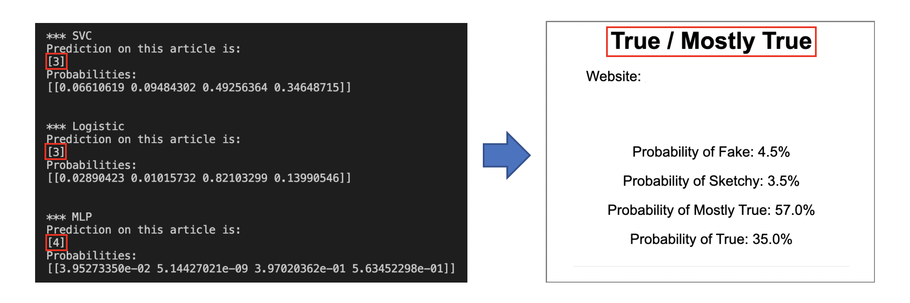
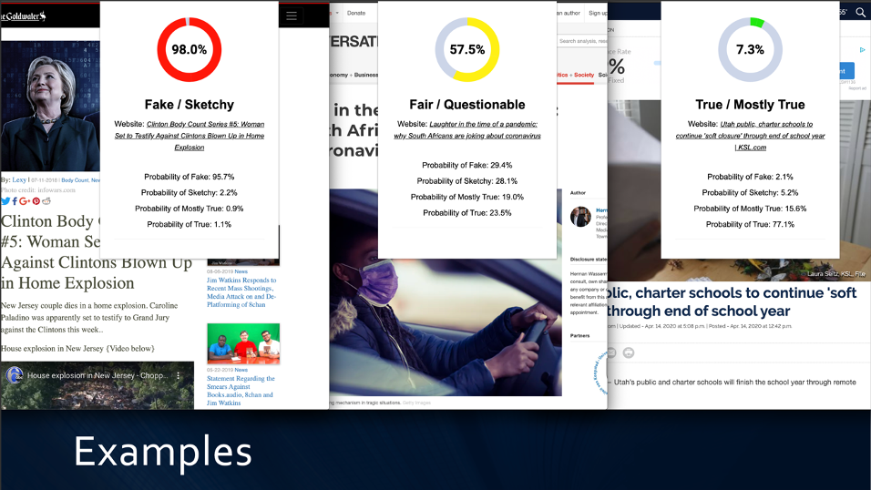

# detection

Detection is a Senior Project created by Colton McEwen.

## **Problem**

Society in the past decade has coined the term “Fake News.” As the name implies, it’s news information that can be inaccurate and/or misleading to the individual. The average person can discern when information is false but comes as an expense of time and background knowledge to determine the outcome appropriately. At the same time, reporters, journalists, computers, etc. are getting better and better at developing false, yet convincing information on the web. This becomes an ever-increasing threat to people all around the world. As an answer to this problem, my solution is a web extension that detects information on the web to be true, questionable, or false.

## **Solution**

This web extension has a few features, most of the work happens in the background. When a user has a news article opened on their web browser for example, they will only need to click on the web extension icon for the interface to popup with an animated percentage-based score. The score is colored green, yellow, or red depending on the score it gives. Percentages are as follows:

- 0-32% is True / Mostly true -> green
- 33-66% is Fair / Questionable -> yellow
- 67-100% is Fake / Sketchy -> red

In addition to the main score, it displays the title of the news article for reassurance that the user isn’t pulling a score from some random website. The interface displays a list of 4 additional scores divided up by true, mostly true, sketchy, and fake. The main score is obtained by the combination of both fake and sketchy scores. From this, anyone who wants an easy, convenient way to determine the validity of information on the web can do so with this web extension. A demonstration is doable, but I figured screenshots would be just as good since the web extension displays all the needed information. 

## **Technical Overview**

I used multiple languages for this project, namely Python, JavaScript, HTML, and CSS. Editor of choice was Visual Studio Code and cross-platform browser of choice was Google Chrome to develop the algorithm and web extension. Amazon Web Services (AWS) was chosen to handle the backend work for the web extension. Python and Django environments were used to develop the web app on an AWS EC2 server to provide the resulted outcome. SciKit-learn was used for the machine learning algorithm development to train, test, and deploy models containing data to produce a predicted score for the web extension.

### **Core Architecture**
*Preparing the Data*

- Django was set up to be the backbone framework for the web application and machine learning algorithm. It provided an easy way to migrate all the data to a well-structured database for the Python files to access.
- Two datasets were used from Ad Fontes Media and FakeNewsNet. Both contained a thousand or so URLs containing news articles. One had a bias score next to each URL, and the other simply had a TRUE/FALSE statement next to each URL. Both datasets were edited to have the same scoring to maintain consistency. 
- Several Python scripts were created to prepare the data, starting with the ability to load each URL with the urllib3 Python library.
- Scraping the data strained any unnecessary characters, tags, punctuation, etc. and token words using the BeautifulSoup library.
- Once the data was stripped of the things mentioned above, the data then got stemmed (ie. chewing  chew) using the PorterStemmer library by comparing each word to a large dictionary found online.
- The data is then sent to the database where it now contains a set of articles, each with its corresponding URL, stemmed words, and score telling us if it is:
    - True = 4
    - Mostly True = 3
    - Sketchy = 2
    - False = 1
- Finally, a dictionary is created that hosts a matrix of all the articles. Each row of the matrix will hold an entire article with words replaced with a 1 or a 0 depending on if the word matches a unique index in the article.

### *Training the Data*

- A result of the prepared data is a matrix of about 2,000+ articles with scores and about 20,000+ words.
- SciKit-learn library was used for training by splitting the data into a training and testing set. This is absolutely necessary for the algorithm to have data to test against so that it’s able to produce a predictability score.
- Once the data is split, there are several SciKit-learn models to choose from to run against to receive a predictability score:
    - MLPClassifier
    - SVC
    - KNeighborsClassifier
    - LinearDiscriminantAnalysis
    - GaussianNB
    - DecisionTreeClassifier
    - LogisticRegression

- All models were used in testing to see what the top three models were. Of the models listed, MLPClassifier, SVC, and LogisiticRegression came out on top and were ultimately used for the final outcome.
- These top models averaged between 9-12% better than a coin toss. For this, that’s good enough!
- Since training takes a very long time, these models were saved as individual files in order to be quick and make the best use of time when users are expecting a result.
- After saving the models, there is a script to access those saved models and test them against any URL as input. The outcome shows results from each model displaying four percentage-based scores using the classification described above (true, mostly true, sketchy, and false).
- Each model also displays an integer between 1-4 which classifies as true, mostly true, sketchy and false based on the four scores given.
- The scores on the screenshots shown below don’t seem to match, but the final result ultimately calculated the averages between the top three models. Though what does match correctly is 3, 3, and 4. This classifies as mostly true, mostly true and true.

---

---

### *Displaying the Data*

- The user interface is pretty straight forward as described earlier, the web extension retrieves the URL from the current website and sends it to an AWS EC2 server for backend processing.
- This method works well because the web extension uses little to no computer resources and results show up in around five seconds.
- For visuals, HTML, JavaScript, and CSS were used to display the web extension popup window.
- On the server side of things, JavaScript was used to interconnect the workings of the Python script that produces the predictability scores.
- Visually speaking, it isn’t fancy but the main score on the web extension is animated!

---

---

## Further Work
I plan to add a simple yes/no feedback feature to help the algorithm better determine the accuracy of the information if the scores display inaccurate results. It will display a little questionnaire as to why the user thinks the scores are inaccurate for the information it gathered.

Another idea is to expand the training algorithm to cover more information and topics all over the web rather than just a subset. Right now, it covers mostly politics, but it would benefit to get more accurate results from a much broader area.